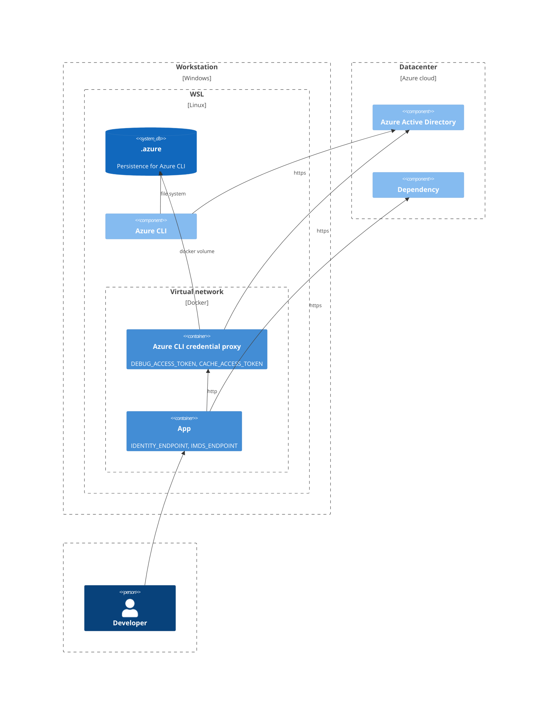

## Background

When developing it is common practice to use AZ CLI to get access tokens from Azure Active Directory. With AZ CLI developers can use their user account instead of relying on managing credentials for a separate service principal.

Running containerized applications with AZ CLI is not practical since AZ CLI is not normally included in the application images targeted for production.

## Solution

Configure the ManagedIdentityCredential of the containerized application to get access tokens from an AZ CLI proxy running as a sidecar.



## Configuration

Example of `docker-compose.yml`:

```yml
version: '3.9'
services:
  my-service:
    ...
    environment:
      - IDENTITY_ENDPOINT=http://azclicredentialproxy:8080/token
      - IMDS_ENDPOINT=dummy_required_value
  azclicredentialproxy:
    image: ghcr.io/classonconsultingab/azclicredentialproxy:v1
    volumes:
      - ~/.azure:/app/.azure
    environment:
      - DEBUG_ACCESS_TOKEN=true
      - CACHE_ACCESS_TOKEN=true
```

Retrieved access tokens will be logged to the console when `DEBUG_ACCESS_TOKEN` is `true`.

The `/app/.azure` volume needs to be from the local `~/.azure` dir created by `az login` on Linux. When AZ CLI is run on Windows it encrypts the content so that it is inaccessible from within the container.

## Benefits

### Run containers with AZ CLI identity

With the Azure CLI credential proxy, the application can run with the same identity as the developer without the need to install any additional dependencies in the app container image used for production.

## Speed up development

When developing locally you can reduce the time to start applications by setting up an Azure CLI credential provider container that runs in the background and then configuring global environment variables for `IDENTITY_ENDPOINT` and `IMDS_ENDPOINT`.

For example:

```powershell
docker run -d --name azclicredentialproxy -p 8080:8080 -v ~/.azure:/app/.azure --restart=always -e DEBUG_ACCESS_TOKEN=true -e CACHE_ACCESS_TOKEN=true ghcr.io/classonconsultingab/azclicredentialproxy:v1
```

> [!WARNING]
Make sure that when running WSL, that your ~/.azure is not linked to the .azure-folder in Windows. If it is so, you need to remove that link, install AZ CLI directly into WSL and then re-login.

### Increased performance

The `DefaultAzureCredential` contains a chain of credentials that attempts to authenticate via multiple methods. These are in order of priority:

- EnvironmentCredential
- ManagedIdentityCredential
- SharedTokenCacheCredential
- VisualStudioCredential
- VisualStudioCodeCredential
- AzureCliCredential
- AzurePowerShellCredential
- InteractiveBrowserCredential

Since `ManagedIdentityCredential` is high up in the list, the app will not waste time trying to authenticate via other methods.

When using the `ManagedIdentityCredential`, we also get the benefit of the built-in access token cache since `Azure.Identity` release 1.8 ([ref](https://github.com/Azure/azure-sdk-for-net/blob/main/sdk/identity/Azure.Identity/CHANGELOG.md#features-added-5)).
